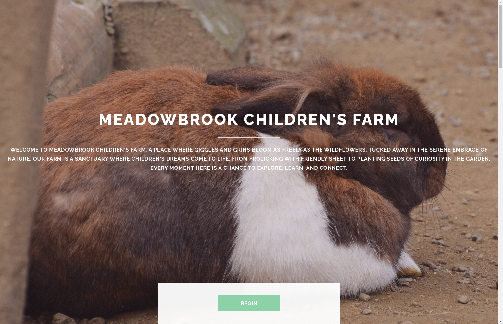

# Meadowbrook Children's Farm Website

[](https://raimonvibe.github.io/Meadowbrook/)

**🌐 [Visit the Live Site](https://raimonvibe.github.io/Meadowbrook/)**

Welcome to my rendition of the Meadowbrook Children's Farm website. I, [raimonvibe](http://raimonvibe.com), have remade this website to showcase my skills in web development.


## Overview

This website serves as an inviting digital gateway to Meadowbrook Children's Farm, featuring:
- A warm, welcoming introduction to our farm's atmosphere
- Detailed sections about animal encounters and nature experiences
- Information about our creative workshops and seasonal celebrations
- An interactive contact form for visitor inquiries
- Social media integration for community engagement

## Features

- **Responsive Design**: Fully responsive layout that works on all devices
- **Interactive Elements**: Dynamic contact form powered by Formspree
- **Smooth Scrolling**: Enhanced user experience with jQuery.scrollex
- **Modern UI**: Clean and intuitive interface with Font Awesome icons

## Local Development

1. Clone the repository:
   ```bash
   git clone https://github.com/raimonvibe/Meadowbrook.git
   ```
2. Navigate to the project directory
3. Open `index.html` in your web browser

## Contributing

Contributions are welcome! Feel free to:
1. Fork the repository
2. Create your feature branch
3. Submit a pull request with your changes

## Technical Credits

This project leverages several open-source technologies:
- **Framework**: [HTML5 UP](https://html5up.net/)
- **Libraries**: 
  - [jQuery](https://jquery.com/)
  - [Scrollex](https://github.com/ajlkn/jquery.scrollex)
  - [Responsive Tools](https://github.com/ajlkn/responsive-tools)
- **Icons**: [Font Awesome](https://fontawesome.io)
- **Images**: [Unsplash](https://unsplash.com) (CC0 licensed)

## License

This project is available under the [CCA 3.0 license](https://html5up.net/license).

## Contact

For questions, support, or inquiries:
- Email: info@raimonvibe.com
- Website: [raimonvibe.com](http://raimonvibe.com)
